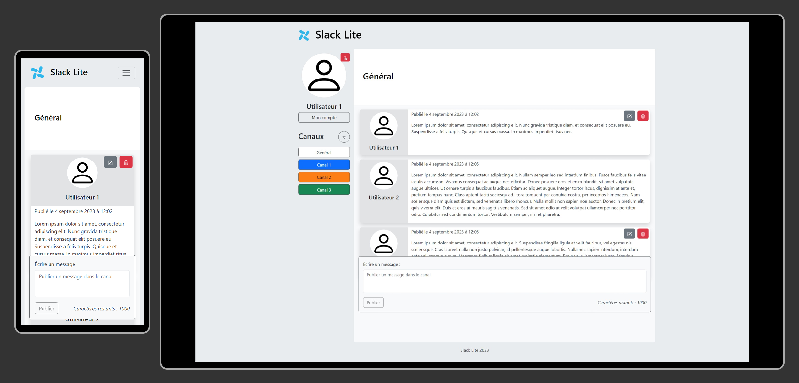

# m2i-slack-lite
slack like project for m2i certification



## For backend & frontend

Clone the repository [here](https://github.com/NicolasDuquesne2/m2i-slack-lite.git)

## Backend

### Abstract

This backend handles a slack like data base and runs as a REST API

### How to install

1. Config the [application.properties](./backend/src/main/  resources/application.properties) file

    ```
    server.port=8080
    server.servlet.context-path=/api/v1
    spring.datasource.url=jdbc:mysql://localhost:3306/${YOUR_DATA_BASE_NAME}
    spring.datasource.username={YOUR_DATA_BASE_USER_NAME}
    spring.datasource.password={YOUR_DATA_BASE_PASSWORD}
    ```
1. Launch the server 

### API Endpoints

/!\ Be sure that the back server runs before using endpoints documentation 

 API Documentation [here](http://localhost:8080/api/v1/swagger-ui/index.html)

 
## FrontEnd

1. Move into front
1. Install dependencies
    ```
    npm install
    ```
1. launch the front server
    ```
    ng serve --open
    ```
    If the front don't start automatically, try at ```http://localhost:4200```